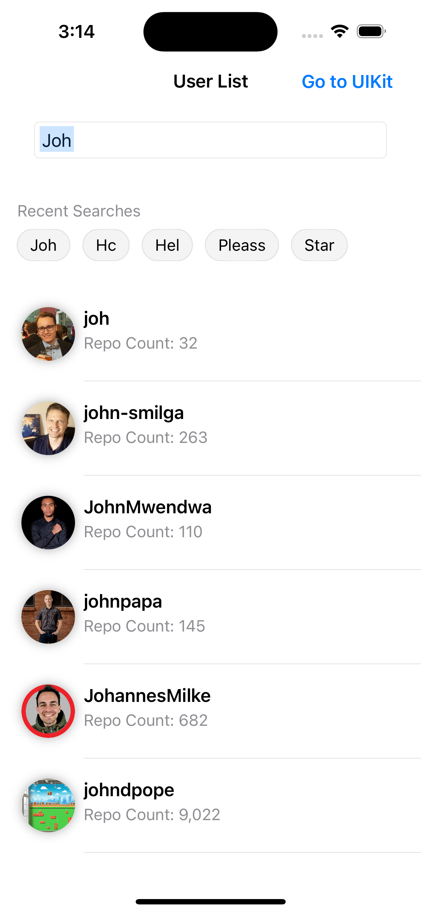
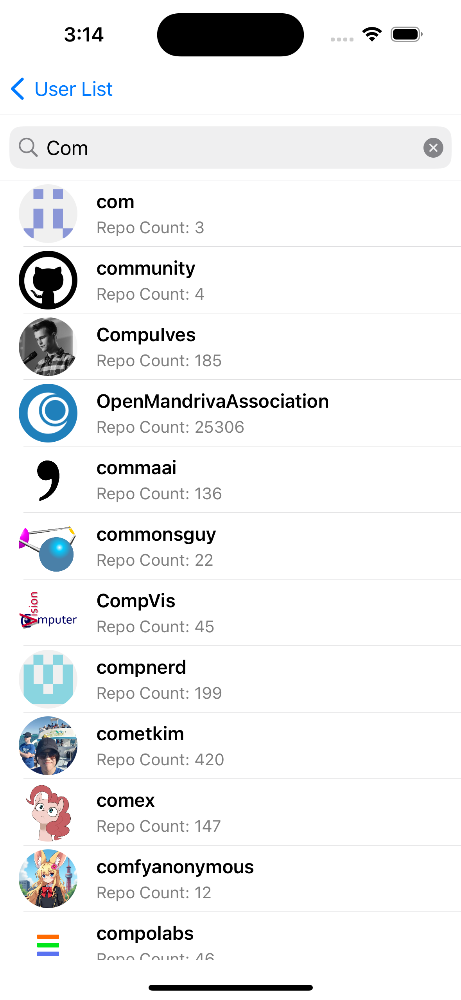

# Github Fetch
This repository contains a Kotlin Multiplatform project focused on implementing a user search feature, demonstrating seamless integration between shared logic and platform-specific implementations. Built with SwiftUI and UIKit for iOS, the project showcases modern development practices like Flow, coroutines, and clean architecture. It leverages libraries such as Kotlinx Coroutines, Kotlinx Serialization, SQLDelight for local data persistence, Ktor for network communication, Koin for dependency injection, RxSwift for reactive programming, and NativeCoroutines for bridging shared logic with platform code. This setup is ideal for exploring cross-platform development with Kotlin Multiplatform and modern iOS UI frameworks.

   

